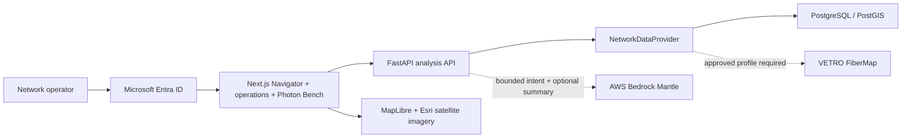

# Photon-Ops Navigator — Technical Stack

## Executive architecture

Photon-Ops Navigator is one portable application delivered as a laptop-ready Docker demo and a production Amazon EKS deployment. Both surfaces run the same AI-guided intake, provider-verified network workflow, satellite-map UI, deterministic fiber analysis, and Photon Bench optical model.

## Stack at a glance

| Layer | Technology | Role |
|---|---|---|
| Experience | Next.js 16.2.10, React 19.2.7, TypeScript 5.7.2 | Conversational intake, operations, and optical-analysis workspace |
| Identity | Microsoft Entra ID, MSAL Browser 5.17.1, MSAL React 5.5.3 | Single-tenant SSO using authorization code flow with PKCE |
| Data interaction | TanStack Query 5.66.11 | API state, caching, mutations, and error handling |
| Mapping | MapLibre GL 5.1.0, GeoJSON, Esri World Imagery | Real satellite context with plant topology, ordered circuits, and correlated faults |
| Optical engineering | Native TypeScript Photon Bench model | Distance conversion, attenuation, event loss, power window, headroom, and OTDR comparison |
| API | Python 3.12, FastAPI 0.139.2, Pydantic 2.13.4 | Typed REST API, token enforcement, analysis, and reporting |
| Data access | SQLAlchemy 2.0.51, asyncpg 0.30.0, GeoAlchemy2 0.18.0 | Async relational and geospatial persistence |
| Database | PostgreSQL 16 + PostGIS 3.4 | Assets, cables, ordered routes, circuits, incidents, and spatial search |
| Optional AI | Amazon Bedrock Mantle in `us-east-1` | Bounded intake extraction and non-authoritative executive wording; provider data and deterministic results remain authoritative |
| Demo deployment | Docker Compose | Self-contained demonstration with deterministic fictional data |
| Production deployment | Amazon EKS, Helm, ALB, ECR, RDS/PostGIS | Replicated, health-checked, autoscaled production surface |
| Delivery | GitHub Actions | Tests, type checking, builds, dependency audit, images, and OIDC-based AWS deployment |

## Security architecture

- Browser requests an API-specific delegated token; no client secret is present in the SPA.
- FastAPI validates RSA signature, tenant, issuer, audience, authorized client, timestamps, and scope.
- Production startup fails if Entra ID is disabled or incomplete.
- CORS uses explicit origins and bearer authentication; credentialed cross-origin requests are disabled.
- Frontend and API add defensive browser/API headers and prevent framing.
- EKS pods run as non-root with dropped capabilities, read-only filesystems, resource bounds, disruption budgets, and network policies.
- Runtime credentials come from Kubernetes Secrets or AWS Secrets Manager through External Secrets.
- Bedrock Mantle is optional, restricted to the AWS regional endpoint, called with response storage disabled, and cannot mark an invented circuit as verified.

## Deployment profiles

### Docker demo

- One command: `docker compose up --build`
- Next.js, FastAPI, and PostGIS on an isolated Compose network
- Fictional, repeatable Maine topology and known OTDR incidents on real satellite imagery
- Guided parser labels itself as AI-off while exercising the same provider-resolution workflow
- Authentication explicitly disabled unless Entra IDs are supplied
- Database not published to the host

### EKS production

- Region: `us-east-1`
- ALB ingress with HTTPS redirect, ACM certificate, and optional AWS WAF
- Two replicas each for web and API with HPA and PDB protection
- RDS PostgreSQL/PostGIS; production seed disabled
- Entra ID required and fail-closed
- Optional External Secrets and Bedrock Mantle for LLM-guided intake
- VETRO FiberMap adapter gated on customer-approved API documentation and read scope

## Design principles

1. **Deterministic before generative:** outage and optical decisions never depend on an LLM.
2. **Route distance, not map distance:** OTDR and loss calculations use ordered cable segments.
3. **One codebase, two deployment surfaces:** demo behavior and production behavior do not diverge.
4. **Provider-neutral data access:** demo PostGIS and future approved plant systems implement the same contract.
5. **Planning transparency:** assumptions and engineering margins remain visible to the operator.
6. **Interpret, then verify:** LLM output is bounded intent; only a network-provider match can verify a circuit.
